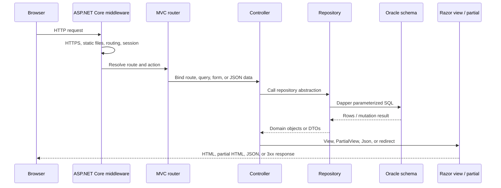
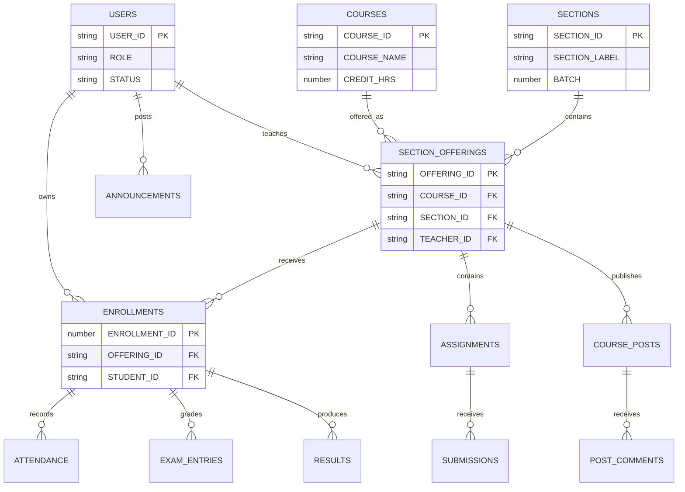

# OMNI-FLEX

<div align="center">

### A role-based academic operations portal built with ASP.NET Core 9 MVC

[](https://dotnet.microsoft.com/)
[](https://learn.microsoft.com/dotnet/csharp/)
[](https://learn.microsoft.com/aspnet/core/mvc/)
[](https://github.com/DapperLib/Dapper)
[](https://www.oracle.com/database/)
[](#contributing--code-conventions)

<span style="color:#5B6472">A monolithic MVC learning-management experience for administrators, instructors, teaching assistants, and students.</span>

<br />

<a href="#installation--local-development">Run locally</a> ·
<a href="#route-and-controller-map">Explore routes</a> ·
<a href="#architecture">Architecture</a> ·
<a href="#troubleshooting-and-faq">Troubleshoot</a>

</div>

> [!IMPORTANT]
> This README describes the repository as it exists today.

## Table of Contents

- [🏗️ Architecture](#architecture)
- [✨ Key Features](#key-features)
- [🔄 Visual Workflows](#visual-workflows)
- [🗂️ Module and Directory Breakdown](#module-and-directory-breakdown)
- [🧭 Route and Controller Map](#route-and-controller-map)
- [⚙️ Configuration and Environments](#configuration-and-environments)
- [🚀 Installation and Local Development](#installation-and-local-development)
- [🎨 Frontend Customization](#frontend-customization)
- [🤝 Contributing and Code Conventions](#contributing-and-code-conventions)
- [🛡️ Production Readiness](#production-readiness)
- [🧰 Troubleshooting and FAQ](#troubleshooting-and-faq)

## Architecture

OMNI-FLEX is a single ASP.NET Core web project in `Omni-Flex.sln`. The active web surface is conventional MVC: controllers resolve repositories through dependency injection, repositories execute parameterized Oracle SQL through Dapper, and controllers pass domain data into strongly typed Razor views or partial views.

```text
Browser -> ASP.NET Core 9 middleware -> MVC route -> Controller
       -> Repository / DbConnectionFactory -> Oracle OMNI_FLEX schema
       -> ViewModel / DTO -> Razor HTML, partial HTML, JSON, or redirect
```

### Runtime composition

| Concern | Repository implementation |
| --- | --- |
| Target framework | `net9.0` |
| Web framework | ASP.NET Core MVC via `AddControllersWithViews()` |
| Presentation | Server-rendered Razor views and partial views |
| Database | Oracle through `Oracle.ManagedDataAccess.Core` |
| ORM/data access | Dapper `2.1.72` with parameterized Oracle SQL |
| Password library | `BCrypt.Net-Next 4.0.3` is referenced, but login currently compares the submitted value directly |
| State | In-memory distributed cache plus two-hour ASP.NET session |
| Authentication | Custom session state; no ASP.NET Core Identity or cookie authentication is configured |
| Authorization | `UseAuthorization()` is in the pipeline, but access checks are primarily manual session checks |
| Client UI | Bootstrap 5.3, Bootstrap Icons, Animate.css, Chart.js, jQuery, custom JavaScript and CSS |

### Dapper data-access model

Dapper is a lightweight .NET micro-ORM. It extends an ADO.NET connection with fast object mapping while leaving SQL, joins, projections, transactions, and database-specific behavior under application control. In OMNI-FLEX:

- `DbConnectionFactory` creates and opens an `OracleConnection` and sets the `OMNI_FLEX` schema for the session.
- Repository classes obtain connections from the factory and execute parameterized Oracle SQL through Dapper.
- Dapper maps query results to domain models, DTOs, and view-model data without a tracked entity graph.
- CRUD, filtering, grading, attendance, enrollment, and reporting behavior is implemented in repository SQL rather than generated by a model-first ORM.
- Oracle schema creation and change management are external to the application; this project has no EF tooling, `DbContext`, or EF migration pipeline.

## Key Features

- **Administrator portal:** dashboard metrics, course and section management, user management, announcements, instructor assignments, class representatives, and settings/report screens.
- **Instructor portal:** assigned courses, classroom streams, posts, assessments, online/onsite grading, grade grids, people lists, and attendance management.
- **Student portal:** profile dashboard, enrolled classes, course stream/classwork/people tabs, attendance, transcript, calendar, marks, to-do, archived classes, and settings.
- **Role-aware sign-in:** login redirects `Admin`, `Instructor`, `TA`, and `Student` users to the corresponding portal. TAs currently use the instructor portal.
- **Partial-page interactions:** student course tabs use `fetch`, AJAX partials, `pushState`, and browser history; instructor classroom tabs use jQuery AJAX; admin CRUD flows use JSON endpoints.
- **Oracle schema integration:** repositories query tables such as `USERS`, `COURSES`, `SECTIONS`, `SECTION_OFFERINGS`, `ENROLLMENTS`, `ASSIGNMENTS`, `SUBMISSIONS`, `ATTENDANCE`, `RESULTS`, and related announcement/file/comment tables.

## Visual Workflows

### Request lifecycle



### Data relationships used by the application



## Module and Directory Breakdown

### Solution and host

| Path | Responsibility |
| --- | --- |
| `Omni-Flex.sln` | Single-solution entry point. |
| `Omni-Flex.csproj` | Web SDK project targeting .NET 9 with nullable reference types and implicit usings enabled. |
| `Program.cs` | MVC, session, repository registrations, middleware, and conventional/custom route mapping. |
| `Infrastructure/DbConnectionFactory.cs` | Creates an open Oracle connection, enables `BindByName`, and sets the `OMNI_FLEX` current schema. |
| `appsettings*.json` | Logging, host, and Oracle connection configuration. |
| `Properties/launchSettings.json` | Development HTTP/HTTPS and IIS Express profiles. |

### Controllers

- `HomeController`: renders the landing page at `Home/Index`.
- `AuthController`: renders the role-aware login page, validates a user through `IUserRepository`, writes `UserId`, `UserName`, and `Role` into session, and clears session on logout.
- `AdminController`: dashboard aggregation, paginated user/course views, announcements, course/section/user CRUD, assignments, and password changes. It also contains direct Dapper queries for specialized course filtering.
- `InstructorController`: instructor dashboard/courses/classroom, classroom partial loading, post and assessment creation, grading, and attendance operations.
- `StudentController`: student dashboard, enrollment/course details, course comments, attendance, transcript, and presentation-oriented sample screens.
- `DbTestController`: development-only database probe that queries `SELECT * FROM Users`. Its constructor requests `IDbConnection`, but `Program.cs` does not currently register that service.

### Models, contracts, and business helpers

| Directory | Contents |
| --- | --- |
| `Models/Domain/Admin` | Users, departments, courses, sections, offerings, semesters, enrollment, assignments, submissions, exams, attendance, results, announcements, comments, and files. |
| `Models/Domain/Instructor` | Instructor-facing assignment, post, attendance, exam, and submission records. |
| `Models/Domain/Student` | Student-facing user, assignment, attendance, result, submission, announcement, and comment records. |
| `Models/DTOs` | Filtering, enrollment, instructor/section assignments, TA assignments, attendance, grade grids, and password changes. |
| `Models/ViewModels/Admin` | Admin dashboard, course, section, user, announcement, and generic pagination models. |
| `Models/ViewModels/Instructor` | Instructor dashboard, classroom, assignment, grading, attendance, and post models. |
| `Models/ViewModels/Student` | Student dashboard, course details, enrollment, attendance, calendar, marks, to-do, and transcript models. |
| `Models/ViewModels/LoginViewModel.cs` | Login form model with role, user ID, and password validation. |
| `Models/Services` | Static helper utilities such as `CourseHelper`, `SectionHelper`, `UserHelper`, and `EnrollmentHelper`; these are not registered DI services. |

### Repository layer

`Models/Repositories/Admin` contains interfaces and implementations for users, courses, sections, enrollment, announcements, assignments, submissions, attendance, and results. `Models/Repositories/Instructor` contains `IInstructorRepository` and `InstructorRepository`, which composes several admin repository abstractions and performs instructor-specific queries and mutations.

Repositories obtain connections from `DbConnectionFactory`, use Dapper with named Oracle parameters, and generally dispose connections with `using`. Dapper performs mapping only; the repository remains responsible for SQL shape, validation, transactions, and Oracle-specific behavior.

### Views and Razor Pages

The active MVC view tree is `Views/`:

- `Views/Shared/_Layout.cshtml`: general layout and shared CSS/JavaScript.
- `Views/Shared/_AdminLayout.cshtml`, `_InstructorLayout.cshtml`, `_StudentLayout.cshtml`: role-specific shells and navigation.
- `Views/Shared/*Sidebar.cshtml`, `_TopNavbar.cshtml`, `_NotificationsOffcanvas.cshtml`, `_ConfirmDeleteModal.cshtml`, and `_ValidationScriptsPartial.cshtml`: shared UI fragments.
- `Views/Admin`: dashboard, courses, sections, users, announcements, reports, and settings.
- `Views/Instructor`: dashboard, courses, classroom, attendance, and weekly-calendar markup, plus classroom/grading partials.
- `Views/Student`: dashboard, enrolled classes, course details, attendance, marks, transcript, calendar, to-do, archived classes, settings, and course partials.
- `Views/Auth/Login.cshtml`: login form and role presentation.

`Pages/` contains a separate Razor Pages prototype with admin, auth, shared, and index pages. It is currently **not active** because the host calls `AddControllersWithViews()` but neither `AddRazorPages()` nor `MapRazorPages()`.

### Static assets

| Location | Files and behavior |
| --- | --- |
| `wwwroot/css` | `theme.css`, `components.css`, `site.css`, `landing.css`, `auth.css`, and `admin.css` define shared, landing, auth, and portal styling. |
| `wwwroot/js` | Shared navigation, landing interactions, auth behavior, admin CRUD modules, course details/history, instructor classroom, and attendance manager. |
| `wwwroot/lib` | Local jQuery, jQuery Validation, and unobtrusive validation distributions plus license files. |
| `wwwroot/images` | Static avatar asset. |
| CDN dependencies | Bootstrap, Bootstrap Icons, Animate.css, Chart.js, jQuery, Typed.js, and Google Fonts are referenced from layouts/pages. |

## Route and Controller Map

The default conventional route is `{controller=Home}/{action=Index}/{id?}`. The two named routes below are registered before it. Actions without an explicit verb are reachable through the conventional route and normally serve `GET` requests.

| Method | Route | Action | Response/view |
| --- | --- | --- | --- |
| GET | `/` or `/Home/Index` | `HomeController.Index` | `Views/Home/Index.cshtml` |
| GET/POST | `/Auth/Login` | `AuthController.Login` | `Views/Auth/Login.cshtml` / redirect by role |
| GET | `/Auth/Logout` | `AuthController.Logout` | Clears session, redirects home |
| GET | `/Admin/Dashboard` | `AdminController.Dashboard` | `Views/Admin/Dashboard.cshtml` |
| GET | `/Admin/Courses?page=1` | `AdminController.Courses` | `Views/Admin/Courses.cshtml` |
| GET | `/Admin/Sections` | `AdminController.Sections` | `Views/Admin/Sections.cshtml` |
| GET | `/Admin/Users?page=1` | `AdminController.Users` | `Views/Admin/Users.cshtml` |
| GET | `/Admin/Instructors`, `/Admin/Admins`, `/Admin/TAs`, `/Admin/Students` | Matching admin actions | Render `Views/Admin/Users.cshtml` |
| GET | `/Admin/Announcements`, `/Admin/Reports`, `/Admin/Settings` | Matching admin actions | Matching admin views |
| POST | `/Admin/FilterCourses` | `FilterCourses` | JSON course results |
| GET/POST | `/Admin/GetCourse`, `/Admin/CreateCourse`, `/Admin/UpdateCourse`, `/Admin/DeleteCourse`, `/Admin/ToggleCourseStatus` | Course AJAX actions | JSON |
| GET/POST | `/Admin/GetUser`, `/Admin/CreateUser`, `/Admin/UpdateUser`, `/Admin/DeleteUser`, `/Admin/ChangePassword` | User AJAX actions | JSON |
| GET | `/Admin/GetActiveCourses`, `/Admin/GetSectionsByCourse`, `/Admin/GetInstructorAssignments`, `/Admin/GetInstructors`, `/Admin/GetSectionStudents` | Admin lookups | JSON |
| GET/POST | `/Admin/AssignInstructorToSection`, `/Admin/AssignInstructorToCourse` | Instructor assignment actions | JSON |
| GET/POST | `/Admin/GetSection`, `/Admin/CreateSection`, `/Admin/UpdateSection`, `/Admin/DeleteSection`, `/Admin/AssignCR` | Section AJAX actions | JSON |
| GET | `/Instructor`, `/Instructor/Index` | `InstructorController.Index` | Redirects to dashboard or instructor login |
| GET | `/Instructor/Dashboard`, `/Instructor/Courses` | Instructor portal actions | Matching instructor views |
| GET | `/Instructor/Classroom/{offeringId}/{tab?}` | `Classroom` | `Views/Instructor/Classroom.cshtml` |
| POST | `/Instructor/GetStreamPartial`, `/Instructor/GetClassworkPartial`, `/Instructor/GetPeoplePartial`, `/Instructor/GetGradesPartial` | Classroom tab actions | Instructor partial views |
| POST | `/Instructor/AddPost`, `/Instructor/AddAssessment`, `/Instructor/BulkGradeOnsite` | Classroom mutations | JSON |
| GET | `/Instructor/AssignmentDetail/{assignmentId}` | `AssignmentDetail` | `_InstructorAssignmentDetail.cshtml` |
| GET | `/Instructor/GradeAssignment/{assignmentId}` | `GradeAssignment` | `_GradeOnline.cshtml` or `_GradeOnsite.cshtml` |
| GET | `/Instructor/ManageAttendance` | `ManageAttendance` | `Views/Instructor/ManageAttendance.cshtml` |
| POST | `/Instructor/BulkAddAttendance`, `/Instructor/UpdateSingleStatus` | Attendance mutations | JSON/HTTP status |
| GET | `/Student`, `/Student/Index` | `StudentController.Index` | Redirects to dashboard or student login |
| GET | `/Student/Dashboard`, `/Student/Enrolled`, `/Student/Attendance`, `/Student/Transcript` | Student portal actions | Matching student views |
| GET | `/Student/Course/{courseId}/{tab?}` | `CourseDetails` | Full view or course partial |
| POST | `/Student/AddPostComment` | Course discussion mutation | JSON |
| GET | `/Student/CourseRegistration`, `/Student/ToDo`, `/Student/Calendar`, `/Student/Marks`, `/Student/ArchivedClasses`, `/Student/Settings` | Student actions | Matching student views |
| GET | `/DbTest/Index` | `DbTestController.Index` | JSON database probe; missing `IDbConnection` registration |

## Configuration and Environments

### `appsettings.json` reference

| Key | Type | Current default | Description |
| --- | --- | --- | --- |
| `Logging:LogLevel:Default` | string | `Information` | Default application logging threshold. |
| `Logging:LogLevel:Microsoft.AspNetCore` | string | `Warning` | Reduces framework log noise. |
| `AllowedHosts` | string | `*` | Host filtering value; restrict this in deployment. |
| `ConnectionStrings:OracleDb` | string | `User Id=omni_flex;Password=fast;Data Source=localhost:1521/XEPDB1;` | Oracle connection consumed by `DbConnectionFactory`. |

`appsettings.Development.json` currently overrides only logging. `launchSettings.json` sets `ASPNETCORE_ENVIRONMENT=Development` and exposes `http://localhost:5182`, `https://localhost:7086`, and IIS Express ports `40651`/`44361`.

> [!CAUTION]
> The checked-in connection string contains a plaintext database password. Move it to user secrets, environment variables, or a managed secret store before sharing or deploying the application.

ASP.NET Core loads `appsettings.json`, then `appsettings.{Environment}.json`, followed by environment variables and other configured providers. A local override can use `ConnectionStrings__OracleDb`.

## Installation and Local Development

### Prerequisites

- .NET 9 SDK.
- Oracle Database XE or another compatible Oracle instance.
- An `OMNI_FLEX` schema containing the tables and constraints expected by the repositories.
- Visual Studio 2022, VS Code with C# tooling, or JetBrains Rider.

### Clone and configure

```powershell
git clone <repository-url>
cd Omni-Flex
dotnet restore
dotnet user-secrets init
dotnet user-secrets set "ConnectionStrings:OracleDb" "User Id=<user>;Password=<password>;Data Source=localhost:1521/XEPDB1;"
```

The connection factory also executes `ALTER SESSION SET CURRENT_SCHEMA = OMNI_FLEX`, so the database user must be able to access that schema.

### Database setup

This repository uses Dapper rather than an entity-tracking ORM. It does not contain an application-managed schema migration runner or SQL schema scripts. Provision the Oracle schema through the project’s external database scripts or DBA process, then verify connectivity with repository queries.

> [!WARNING]
> A successful `dotnet build` does not prove that the database is ready. Objects, seed users, grants, Oracle service names, and expected columns must be provisioned separately.

### Build and run

```powershell
dotnet build Omni-Flex.sln
dotnet run --project Omni-Flex.csproj --launch-profile https
```

Open <https://localhost:7086> or <http://localhost:5182>. In Visual Studio, select the `https` profile and press `F5`.

## Frontend Customization

Shared layouts load Bootstrap 5.3, Bootstrap Icons, Animate.css, jQuery, and local theme/component styles. Admin and portal layouts also load Chart.js. Page-specific scripts are included by the relevant `.cshtml` files.

### JavaScript modules

| Script | Responsibility |
| --- | --- |
| `site.js` / `landing.js` | Shared navigation, landing role cards, and delayed navigation. |
| `auth.js` | Role badge/login presentation and browser history behavior. |
| `admin.js` | Shared admin navigation/table behavior. |
| `admin-courses.js` | Course search/filtering, CRUD, status changes, instructor assignment, and `/Admin` JSON calls. |
| `admin-sections.js` | Section CRUD, student loading, CR assignment, and deletion. |
| `admin-users.js` | User search, role filtering, CRUD, and instructor/section assignment. |
| `admin-announcements.js` | Announcement search, modal, and list events. |
| `admin-reports.js` | Chart.js report dashboards using client-side demo data. |
| `admin-settings.js` | Theme/font/color/logo controls; persistence is currently simulated. |
| `Instructor-classroom.js` | Classroom tabs, posts, assessments, assignment detail, and grading AJAX. |
| `attendance-manager.js` | Bulk and individual attendance updates through `fetch`. |
| `course-details.js` | Student tabs, comments, partial loading, `pushState`, and history support. |

### CSS modules

Use `theme.css` for design tokens and global theme decisions, `components.css` for reusable pieces, `landing.css` for the home page, `auth.css` for login presentation, `admin.css` for portal surfaces, and `site.css` for general site rules. Preserve `asp-append-version="true"` for cache-busted local assets.

## Contributing and Code Conventions

- Keep nullable reference types enabled and resolve warnings rather than suppressing them broadly.
- Prefer asynchronous repository calls and validate DTOs at HTTP boundaries.
- Keep SQL in repositories, use Dapper parameters, and dispose connections deterministically.
- Keep controller actions focused on validation, orchestration, and mapping.
- Use strongly typed view models in Razor views and keep partials narrow.
- Follow existing PascalCase controller/action names and endpoint names used by client scripts.
- Keep secrets out of `appsettings.json`; use user secrets or deployment secret providers.
- Add focused automated tests before changing shared repository behavior. No visible test project currently exists.
- In pull requests, describe database prerequisites, route/API changes, session/auth implications, and manual verification steps.

## Production Readiness

The application is a development-stage project. Before production deployment:

- Replace plaintext password comparison with complete BCrypt verification, reset, lockout, and secure session handling.
- Add formal authentication and authorization policies; current role checks rely on session values and several actions lack explicit role checks.
- Remove or protect `DbTestController`; it exposes database rows and has an unresolved `IDbConnection` dependency.
- Move credentials out of configuration files and restrict `AllowedHosts`.
- Add CSRF protection and validation to JSON mutation endpoints, rate limiting, and audit logging.
- Replace hard-coded student sample data and simulated admin settings/reports with persisted behavior.
- Version the Oracle schema through a controlled migration or DBA release process.
- Add unit/integration tests for repositories, role boundaries, route responses, and CRUD workflows.

## Troubleshooting and FAQ

### Oracle connection failures

Check that the listener and `XEPDB1` service are running, credentials are valid, `OMNI_FLEX` exists, and the connection string is loaded from the intended provider. Missing grants or an incorrect service name are common causes.

### HTTPS certificate errors

```powershell
dotnet dev-certs https --clean
dotnet dev-certs https --trust
```

Restart the development server after changing the certificate.

<div align="center"><span style="color:#5B6472">Keep this document aligned with the active MVC surface and the external Oracle schema.</span></div>